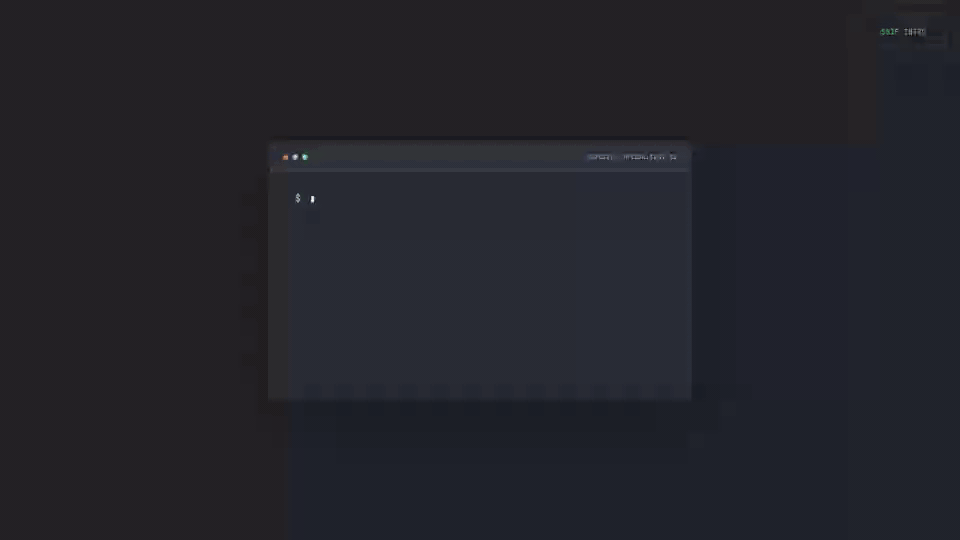

<div align="center">

# Leonardo Bumbeers

### Senior Quality Assurance Engineer · ISTQB CTFL

**Test smarter. Release with confidence.**

I help global teams find risk early and ship reliable software across web, API,
mobile, and AI/data platforms.

[](https://leonardo-bumbeers.dev)
[](https://www.linkedin.com/in/leonardobumbeers)
[](mailto:leo.brsouza@gmail.com)

Based in Brazil · Working worldwide

</div>

<a href="https://leonardo-bumbeers.dev">
  
</a>

<p align="center">
  <sub>Click the preview to experience the full interactive portfolio in English, Portuguese, or Spanish.</sub>
</p>

## `quality.log`

I am a quality engineer with **9+ years of experience** turning complex product
risk into clear, automated feedback. My work sits at the intersection of
hands-on testing, test architecture, delivery pipelines, and product thinking.

- I design maintainable automation for browser, mobile, and service layers.
- I test beyond the happy path: contracts, data, permissions, integrations, and failure modes.
- I bring quality into CI/CD so teams get useful feedback before production.
- I work comfortably across codebases, cloud platforms, databases, and global teams.

## Selected work

### [leonardo-bumbeers.dev](https://leonardo-bumbeers.dev) — Interactive quality portfolio

A portfolio designed as a live quality-engineering runtime: an animated test-run
intro, looping quality gate, typed multilingual content, scroll-driven reveals,
and a responsive editorial interface.

`Next.js 16` · `React 19` · `TypeScript` · `i18n` · `OpenNext` · `Cloudflare`

### [Amor Miau](https://github.com/leonardobumbeers/amormiau-frontend) — Full-stack cat adoption platform

A responsive adoption experience backed by an auditable, role-based workflow.
The frontend covers discovery, applications, and staff review with Playwright
E2E scenarios; the [API](https://github.com/leonardobumbeers/amormiau-backend)
adds authentication, authorization, Jest/Supertest coverage, CI, CodeQL, and
production smoke tests.

`Next.js` · `TypeScript` · `Playwright` · `Node.js` · `Express` · `MongoDB` · `Jest`

### [mcp-google-calendar](https://github.com/leonardobumbeers/mcp-google-calendar) — Calendar automation through MCP and WhatsApp

A Google Calendar and Tasks integration with two interfaces: an MCP server for
AI clients and a WhatsApp bot that turns natural-language requests into tool
calls. Both share the same authenticated calendar core.

`TypeScript` · `Model Context Protocol` · `Google APIs` · `LLM tool calling` · `WhatsApp`

## What I run

| Area | Toolkit |
| --- | --- |
| Languages | TypeScript, JavaScript, Java, C#, Ruby, Python |
| Test automation | Playwright, Cypress, Selenium, WebdriverIO, Appium, Robot Framework, Cucumber |
| API and services | REST, GraphQL, Postman, SoapUI, RestAssured, Supertest |
| Data | PostgreSQL, MongoDB, MySQL, SQL Server, Oracle, Neo4j |
| Delivery | GitHub Actions, Jenkins, AWS, GCP, Azure, BrowserStack, Sauce Labs |
| Ways of working | Test strategy, risk-based testing, CI/CD, Scrum, Kanban |

## Final assertion

```ts
const result = await buildQualityIntoDelivery();

expect(result.risks).toBeVisibleEarly();
expect(result.releaseConfidence).toBeHigh();
```

If you are building something that needs to work—not only on one machine—visit
[my portfolio](https://leonardo-bumbeers.dev) or
[send me a message](mailto:leo.brsouza@gmail.com).
